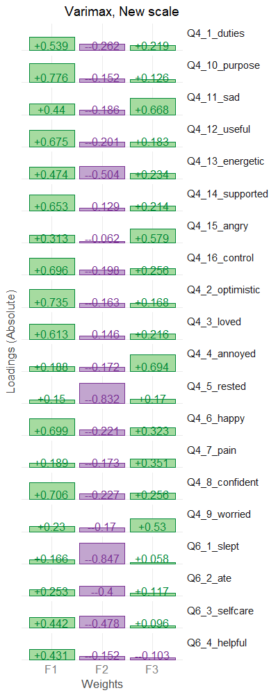
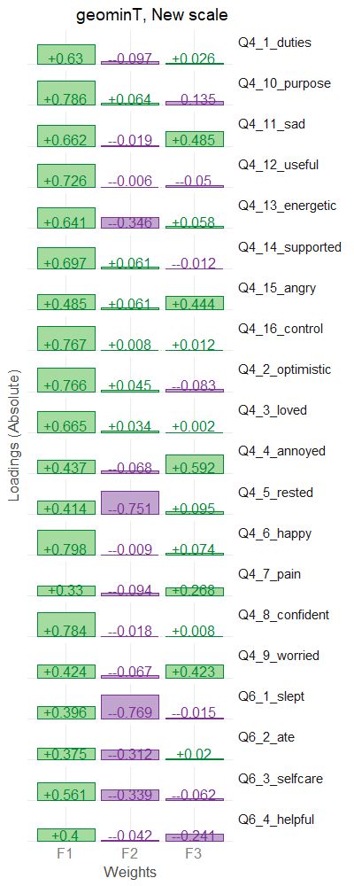
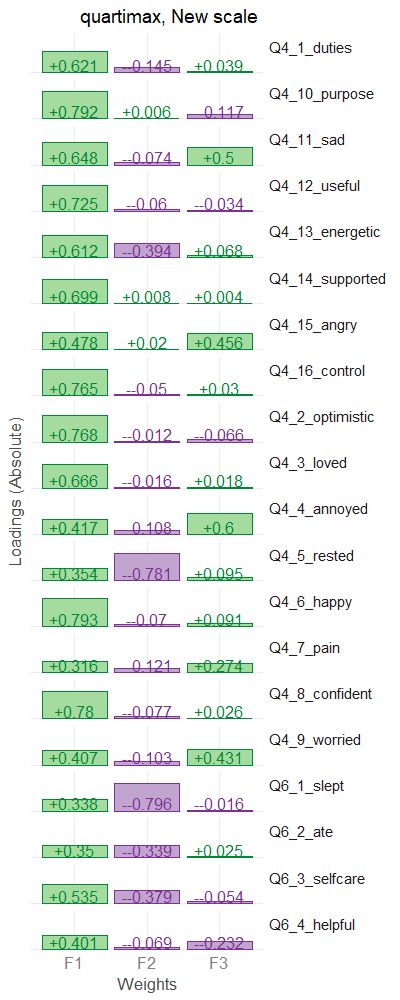
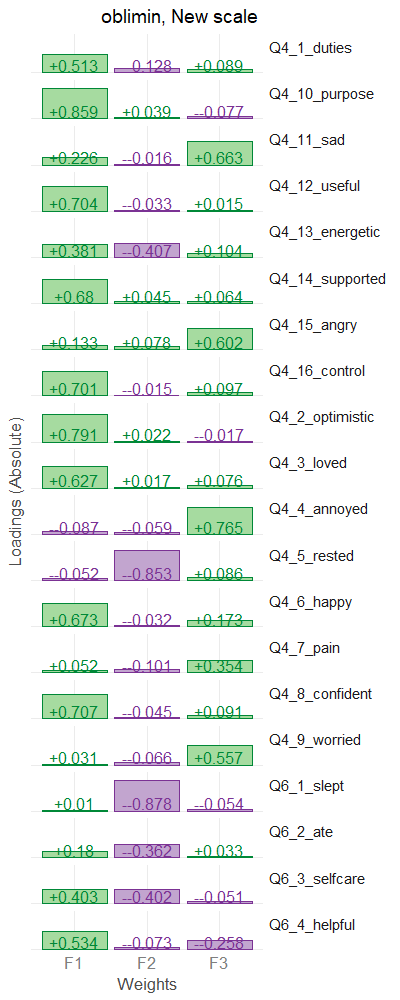
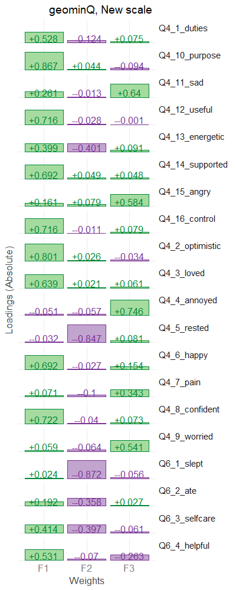

This report narrates the process of factor analizing the proposed scale
<!-- These two chunks should be added in the beginning of every .Rmd that you want to source an .R script -->
<!--  The 1st mandatory chunck  -->
<!--  Set the working directory to the repository's base directory -->


<!--  The 2nd mandatory chunck  -->
<!-- Set the report-wide options, and point to the external code file. -->


<!-- Load 'sourced' R files.  Suppress the output when loading packages. --> 

```
Warning: package 'sem' was built under R version 3.6.3
```

```
Warning: package 'corrplot' was built under R version 3.6.3
```

```
Warning: package 'corrgram' was built under R version 3.6.3
```

<!-- Load the sources.  Suppress the output when loading sources. --> 


<!-- Load any Global functions and variables declared in the R file.  Suppress the output. --> 


<!-- Declare any global functions specific to a Rmd output.Suppress the output. --> 


<!-- Load the datasets.   -->


<!-- Inspect the datasets.   -->


<!-- Tweak the datasets.   -->

```
Warning: select_() is deprecated. 
Please use select() instead

The 'programming' vignette or the tidyeval book can help you
to program with select() : https://tidyeval.tidyverse.org
This warning is displayed once per session.
```


# Introduction

The purpose of this research was to develop a new scale for measuring subjective wellbing of people condending with substance use disorder using a mobile device. Participants were 427 students of Indiana State University.


# Overview

By comparing various rotations and considering interpretive qualities of the solutions, we have decided to use orthogonal bifactor rotation, as the one that offers the greatest interpretability. 

## Analysis Steps

   
### 1.Scree 
Scree plot is plotted and top eigen values are displayed

### 2.MAP 
`psych::nfactors` call is applied, producing  Very Simple Structure, Velicer's MAP, and other criteria to determine the appropriate number of factors. See [documentation](http://www.personality-project.org/r/html/VSS.html)

### 3.Parallel Analysis 
`psych::fa.parallel` call is applied, comparing the number of factors in the correlation matrix to random "parallel" matrices. For details, see [documentation](https://www.rdocumentation.org/packages/psych/versions/1.6.9/topics/fa.parallel?)

### 4.Fit
`psych::fa` call is applied to conduct maximum likelihood factor analysis (`fm="ml"`) in order to obtain the chi-square of the proposed models, which incrementally increase the number of retained factors. CFI and TLI indices are then computed, following the formulae:
```
  CFI = ((chisq_null-df_null) - (chisq-df))/(chisq_null-df_null)
  TLI = ((chisq_null/df_null) - (chisq/df))/((chisq_null/df_null)-1)
```
For details on `psych::fa` see [documentation](https://www.rdocumentation.org/packages/psych/versions/1.6.9/topics/fa)

### 5.RMSEA 
RMSEA diagnostic is conducted using [Advanced Factor Function](http://statpower.net/Content/312/R%20Stuff/AdvancedFactorFunctions.txt) by James Steiger. The routine relies on the maxim likelihood factor analysis conducted by `stats::factanal` call. For details on the latter see [here](https://stat.ethz.ch/R-manual/R-devel/library/stats/html/factanal.html) 

### 6.Estimate
Using [Advanced Factor Function](http://statpower.net/Content/312/R%20Stuff/AdvancedFactorFunctions.txt) by James Steiger, we conduct maximum likelihood factor analysis, by obtaining the unrotated solution from `stats::factanal` call and then rotating solution using gradient projection algorithms (Bernaards & Jennrich, 2005). 

### 7.Confirm
Applying "Exploratory-Confirmatory" procedure described by [Joreskog(1978)](https://scholar.google.ca/scholar?q=Structural+analysis+of+covariance+and+correlation+matrices&btnG=&hl=en&as_sdt=0%2C33), we find the largest loading for each column of the factor pattern, then constrain all the other loadings in that row to be zero, and fit the resulting model as a confirmatory factor model. Given that we chose the orthogonal bifactor solution, we permit the the cross-loadings between general factor and subfactors. 


# EFA

We create a correlation matrix using all items on the administered scale and conduct eigen diagnostics: 

## Scree
<!-- -->

```
   eigen     value
1      1 8.2120510
2      2 1.6938274
3      3 1.5492364
4      4 0.8865132
5      5 0.8534162
6      6 0.8341441
7      7 0.7270440
8      8 0.6757051
9      9 0.6091630
10    10 0.5387882
11    11 0.4550178
12    12 0.4447041
13    13 0.3993914
14    14 0.3738538
15    15 0.3482113
```
Scree plot is somewhat ambiguious, suggesting a solution involving up to 3 factors, following the Keiser rule (eigenvalue > 1). 

## MAP
`psych::nfactors` call is applied, producing  Very Simple Structure, Velicer's MAP, and other criteria to determine the appropriate number of factors. See [documentation](http://www.personality-project.org/r/html/VSS.html)

The solution again suggests that no more than 3 meaningful factors can be extracted from the correlation structure.

<!-- -->

```

Number of factors
Call: vss(x = x, n = n, rotate = rotate, diagonal = diagonal, fm = fm, 
    n.obs = n.obs, plot = FALSE, title = title, use = use, cor = cor)
VSS complexity 1 achieves a maximimum of 0.86  with  1  factors
VSS complexity 2 achieves a maximimum of 0.9  with  2  factors
The Velicer MAP achieves a minimum of 0.02  with  3  factors 
Empirical BIC achieves a minimum of  -603.72  with  3  factors
Sample Size adjusted BIC achieves a minimum of  -87.25  with  8  factors

Statistics by number of factors 
   vss1 vss2   map dof   chisq     prob sqresid  fit RMSEA    BIC SABIC complex  eChisq    SRMR eCRMS   eBIC
1  0.86 0.00 0.021 170 1.1e+03 5.2e-135    10.7 0.86 0.113   65.8 605.3     1.0 1.1e+03 8.3e-02 0.088   88.2
2  0.67 0.90 0.020 151 6.6e+02  1.4e-65     8.0 0.90 0.089 -249.6 229.6     1.4 5.8e+02 6.0e-02 0.067 -337.9
3  0.54 0.85 0.017 133 3.9e+02  2.1e-26     5.9 0.92 0.067 -420.1   2.0     1.6 2.0e+02 3.5e-02 0.042 -603.7
4  0.54 0.84 0.021 116 2.9e+02  1.1e-16     5.3 0.93 0.059 -414.1 -46.0     1.7 1.4e+02 3.0e-02 0.038 -558.1
5  0.54 0.79 0.027 100 2.3e+02  7.0e-12     4.7 0.94 0.055 -378.6 -61.2     1.9 1.0e+02 2.5e-02 0.034 -505.1
6  0.52 0.73 0.033  85 1.7e+02  3.4e-07     4.3 0.95 0.047 -348.6 -78.9     2.1 6.6e+01 2.0e-02 0.030 -449.1
7  0.48 0.75 0.041  71 1.2e+02  8.4e-05     3.8 0.95 0.042 -305.2 -79.9     2.1 4.6e+01 1.7e-02 0.027 -384.5
8  0.46 0.71 0.049  58 8.0e+01  2.9e-02     3.3 0.96 0.030 -271.3 -87.3     2.3 2.6e+01 1.3e-02 0.023 -325.7
9  0.40 0.75 0.059  46 5.0e+01  3.1e-01     2.9 0.96 0.014 -228.5 -82.5     2.1 1.7e+01 1.0e-02 0.021 -261.8
10 0.41 0.75 0.066  35 3.3e+01  5.7e-01     2.5 0.97 0.000 -179.1 -68.1     2.0 8.9e+00 7.4e-03 0.017 -203.1
11 0.42 0.64 0.081  25 2.3e+01  6.0e-01     2.8 0.96 0.000 -128.7 -49.4     2.5 6.0e+00 6.1e-03 0.017 -145.5
12 0.46 0.65 0.094  16 1.3e+01  6.8e-01     2.1 0.97 0.000  -84.0 -33.2     2.2 2.8e+00 4.2e-03 0.014  -94.1
13 0.37 0.62 0.116   8 7.1e+00  5.3e-01     2.3 0.97 0.000  -41.4 -16.0     2.5 1.5e+00 3.0e-03 0.015  -47.0
14 0.23 0.42 0.136   1 1.2e+00  2.8e-01     2.3 0.97 0.019   -4.9  -1.7     3.0 2.1e-01 1.1e-03 0.016   -5.8
15 0.23 0.38 0.177  -5 2.0e-04       NA     2.1 0.97    NA     NA    NA     3.3 3.2e-05 1.4e-05    NA     NA
16 0.34 0.56 0.245 -10 1.1e-05       NA     2.0 0.97    NA     NA    NA     2.6 1.7e-06 3.2e-06    NA     NA
17 0.33 0.55 0.369 -14 4.3e-08       NA     2.1 0.97    NA     NA    NA     2.7 7.7e-09 2.2e-07    NA     NA
18 0.33 0.56 0.553 -17 1.9e-08       NA     2.1 0.97    NA     NA    NA     2.7 3.3e-09 1.4e-07    NA     NA
19 0.33 0.56 1.000 -19 4.4e-10       NA     2.1 0.97    NA     NA    NA     2.7 8.2e-11 2.2e-08    NA     NA
20 0.33 0.56    NA -20 4.4e-10       NA     2.1 0.97    NA     NA    NA     2.7 8.2e-11 2.2e-08    NA     NA
```

## Parallel
`psych::fa.parallel` call is applied, comparing the number of factors in the correlation matrix to random "parallel" matrices. For details, see [documentation](https://www.rdocumentation.org/packages/psych/versions/1.6.9/topics/fa.parallel?)

There are only two non-general factors that appear to be more distinguishable than their simulated counterparts. While the analysis technically suggests 4 factors, the last one barely makes the cut ( 0.2696 vs 0.2557) and is not supported by the scree test and MAP analysis.  
<!-- -->

```
Parallel analysis suggests that the number of factors =  4  and the number of components =  NA 
```

```
   observed_eigens simulated_eigens
1      7.655685295       0.61044984
2      0.994542517       0.34685612
3      0.844239726       0.29598141
4      0.269632660       0.23974758
5      0.199970175       0.20371859
6      0.129517289       0.16847548
7      0.039944804       0.12398564
8     -0.006467331       0.09037350
9     -0.026975661       0.06092811
10    -0.052193362       0.01959554
11    -0.060142500      -0.00938798
12    -0.069033568      -0.03984756
13    -0.119911700      -0.06892370
14    -0.176364116      -0.09745562
15    -0.222915845      -0.13561839
```

## Fit
`psych::fa` call is applied to conduct maximum likelihood factor analysls (`fm="ml"`) in order to obtain the chi-square of the proposed models, which incrementally increase the number of retained factors. CFI and TLI indices are then computed from the produced criteria. For details on `psych::fa` see [documentation](https://www.rdocumentation.org/packages/psych/versions/1.6.9/topics/fa)

```
  n_factors chisq_null df_null      chisq  df       CFI       TLI
1         1   4263.511     190 1117.88350 170 0.7673055 0.7399297
2         2   4263.511     190  576.66302 151 0.8955046 0.8685158
3         3   4263.511     190  201.83722 133 0.9831013 0.9758589
4         4   4263.511     190  144.50271 116 0.9930029 0.9885393
5         5   4263.511     190  100.53314 100 0.9998691 0.9997513
6         6   4263.511     190   65.77164  85 1.0047203 1.0105513
```

## RMSEA
RMSEA diagnostic is conducted using [Advanced Factor Function](http://statpower.net/Content/312/R%20Stuff/AdvancedFactorFunctions.txt) by James Steiger. The routine  relies on the maxim likelihood factor analysis conducted by `stats::factanal` call. For details on the latter see [here](https://stat.ethz.ch/R-manual/R-devel/library/stats/html/factanal.html) 

The confidence intervale of RMSEA point estimate does not include values below the threshhold (<.08) for the models with two factors. When a more liberal threshhold is adopted (<.05), the model with 3 factors appear to be preferable. 
<!-- -->

```
     Factors Cum.Eigen Chi-Square  Df      p.value   RMSEA.Pt   RMSEA.Lo   RMSEA.Hi
[1,]       1  8.212051  1090.4368 170 0.000000e+00 0.11273733 0.10639932 0.11917319
[2,]       2  9.905878   655.9242 151 0.000000e+00 0.08859716 0.08170447 0.09560747
[3,]       3 11.455115   376.4958 133 0.000000e+00 0.06555641 0.05781148 0.07340431
[4,]       4 12.341628   282.2465 116 6.661338e-16 0.05800193 0.04943997 0.06663338
[5,]       5 13.195044   221.9364 100 3.058820e-11 0.05350100 0.04403827 0.06298407
[6,]       6 14.029188   161.2841  85 1.170769e-06 0.04589894 0.03496809 0.05662521
```

<!-- -->

```
     Factors Cum.Eigen Chi-Square  Df      p.value   RMSEA.Pt   RMSEA.Lo   RMSEA.Hi
[1,]       1  8.212051  1090.4368 170 0.000000e+00 0.11273733 0.10639932 0.11917319
[2,]       2  9.905878   655.9242 151 0.000000e+00 0.08859716 0.08170447 0.09560747
[3,]       3 11.455115   376.4958 133 0.000000e+00 0.06555641 0.05781148 0.07340431
[4,]       4 12.341628   282.2465 116 6.661338e-16 0.05800193 0.04943997 0.06663338
[5,]       5 13.195044   221.9364 100 3.058820e-11 0.05350100 0.04403827 0.06298407
[6,]       6 14.029188   161.2841  85 1.170769e-06 0.04589894 0.03496809 0.05662521
```

## Estimate
Using  [Advanced Factor Function](http://statpower.net/Content/312/R%20Stuff/AdvancedFactorFunctions.txt) by James Steiger, we conduct maximum likelihood factor analysis, by obtaining the unrotated solution from `stats::factanal` call and then rotating solution using gradient projection algorithms (Bernaards & Jennrich, 2005). 


```
This will take a moment..........exiting
```


```

Loadings above threashold (.3) are masked to see the simpler structure
```


## Confirm
Applying "Exploratory-Confirmatory" procedure described by [Joreskog(1978)](https://scholar.google.ca/scholar?q=Structural+analysis+of+covariance+and+correlation+matrices&btnG=&hl=en&as_sdt=0%2C33), we find the largest loading for each column of the factor pattern, then constrain all the other loadings in that row to be zero, and fit the resulting model as a confirmatory factor model. Given that we chose the orthogonal bifactor solution, we permit the the cross-loadings between general factor and subfactors. 


```

Model Chiquare =  521.5535  | df model =  162  | df null =  190
Goodness-of-fit index =  0.8866976
Adjusted Goodness-of-fit index =  0.8531266
RMSEA index =  .0722           90% CI: (.065,.079)
Comparitive Fit Index (CFI = 0.9133589
Tucker Lewis Index (TLI/NNFI) =  0.8983839
Akaike Information Criterion (AIC) = 617.5535
Bayesian Information Criterion (BIC) = -459.6456
```


# Rotations

## Varimax

<!-- -->


## geominT

<!-- -->


## bifactorT

<!-- -->


## quartimax

<!-- -->


## oblimin

<!-- -->


## geominQ

<!-- -->


## bifactorQ

<!-- -->

# Correlations 


# Decisions

What items should be included into the daily questionnaire? 

Guidelines for preference:   
- High item-total correlation to the new scale  
- High item-total correlation to the CHU and Warwick scales  
- Items should cover all factors that seem to be present (3)  
- Items with more pronounced weights onto a single factore should be preferred  


1. Even though the new scale shows good unidimentionality, diagnostic tests revealed that there appear to be two subfactors:  
  - "Self-Care"  
    - `Q4_13`(_Today I feel energetic_)  
    - `Q4_5` (_Today I feel rested_)  
    - `Q6_1` (_Today I woke up feeling well-rested_)  
    - `Q6_2` (_Today I ate well_)  
    - `Q6_3` (_Today I took good care of myself_)  

  - "Distress"
    - `Q4_11` (_Today I feel sad_)  
    - `Q4_15` (_Today I feel angry_)  
    - `Q4_4`  (_Today I feel annoyed/irritable_)  
    - `Q4_7`  (_Today I feel in physical pain_)  
    - `Q4_9`  (_Today I feel worried/anxious_)  

2. Item `Q4_4` (_Today I feel annoyed/irritable_) was selected because it consistened loaded the strongest onto the "Distress" factor. 

3. Items `Q4_5`(_Today I feel rested_) and `Q6_1`(_Today I woke up feeling well-rested_) had highest loadings on the "Self-Care" factors, consistently across rotations. Deciding between them, we opted for `Q4_5` because it had slightly higher item-total correlations with both the new and existing scales. These two items had a high correlation (R = .75). 

4. Two other items had the next highest loadings on the "Self-Care" factor: `Q4_13`	(_Today I feel energetic_) and `Q6_3`	(_Today I took good care of myself_). We felt that `Q4_13` was similar to `Q4_5`, whicle `Q6_3` provided a different facet of well-being. Therefore, choosing between the two we settled on the latter.

5. We inclued `Q4_6`	(_Today I feel happy_) because it had the highest loading on the general factor and highest item-total correlation on all scales.  

6. With 4 items included into the new questionnaire, we had 2-3 items to assist `Q4_6` in capturing the genral factor. The following group stood out:
 
  - `Q4_8`   (_Today I feel confident_)
  - `Q4_16`  (_Today I feel in charge of my life_)
  - `Q4_10`  (_Today I feel that my life has a purpose_)
  - `Q4_2`   (_Today I feel optimistic about the future_)

All of these appear to have similar loadings, with minor variations. We chose `Q4_10` because this items appears to cover the spiritual/self-actualization domain. We also chose `Q4_8` it had consistently higher loading on the general factor that other two (`Q4_16` and `Q4_2`) while being similar to them in term of the content. 


7. To represent social facet, we chose `Q4_14` (_Today I feel supported_) over `Q4_3` (_Today I feel loved_), because the former had higher loading, and higher item-total correlations. 

# Chosen items

- `Q4_6`	(_Today I feel happy_) 
- `Q4_8`   (_Today I feel confident_)
- `Q4_10`  (_Today I feel that my life has a purpose_)
- `Q4_14` (_Today I feel supported_)

- `Q6_3` (_Today I took good care of myself_) - SELFCARE subfactor
- `Q4_5`(_Today I feel rested_) - SELFCARE subfactor
- `Q4_4` (_Today I feel annoyed/irritable_)  - DISTRESS subfactor


# Reproducibility

```r
sessionInfo()
```

```
R version 3.6.2 (2019-12-12)
Platform: x86_64-w64-mingw32/x64 (64-bit)
Running under: Windows 10 x64 (build 18363)

Matrix products: default

locale:
[1] LC_COLLATE=English_United States.1252  LC_CTYPE=English_United States.1252    LC_MONETARY=English_United States.1252
[4] LC_NUMERIC=C                           LC_TIME=English_United States.1252    

attached base packages:
[1] stats     graphics  grDevices utils     datasets  methods   base     

other attached packages:
 [1] corrgram_1.13         corrplot_0.84         GPArotation_2014.11-1 sem_3.1-9             plotrix_3.7-7        
 [6] psych_1.9.12.31       dplyr_0.8.4           ggplot2_3.2.1         magrittr_1.5          knitr_1.28           

loaded via a namespace (and not attached):
 [1] nlme_3.1-142       bitops_1.0-6       RColorBrewer_1.1-2 mi_1.0             tools_3.6.2        utf8_1.1.4        
 [7] R6_2.4.1           KernSmooth_2.23-16 lazyeval_0.2.2     colorspace_1.4-1   withr_2.1.2        tidyselect_1.0.0  
[13] gridExtra_2.3      mnormt_1.5-6       compiler_3.6.2     extrafontdb_1.0    cli_2.0.1          TSP_1.1-9         
[19] labeling_0.3       caTools_1.18.0     scales_1.1.0       readr_1.3.1        stringr_1.4.0      digest_0.6.24     
[25] minqa_1.2.4        rmarkdown_2.1      dichromat_2.0-0    pkgconfig_2.0.3    htmltools_0.4.0    extrafont_0.17    
[31] lme4_1.1-21        labelled_2.2.2     rlang_0.4.4        farver_2.0.3       testit_0.11        gtools_3.8.2      
[37] dendextend_1.13.4  Matrix_1.2-18      Rcpp_1.0.3         munsell_0.5.0      fansi_0.4.1        abind_1.4-5       
[43] viridis_0.5.1      lifecycle_0.1.0    stringi_1.4.5      yaml_2.2.1         MASS_7.3-51.4      gplots_3.0.3      
[49] plyr_1.8.6         matrixcalc_1.0-3   grid_3.6.2         parallel_3.6.2     gdata_2.18.0       forcats_0.4.0     
[55] crayon_1.3.4       lattice_0.20-38    haven_2.2.0        splines_3.6.2      hms_0.5.3          pillar_1.4.3      
[61] boot_1.3-23        reshape2_1.4.3     codetools_0.2-16   stats4_3.6.2       glue_1.3.1         gclus_1.3.2       
[67] evaluate_0.14      vctrs_0.2.2        nloptr_1.2.2       foreach_1.5.0      Rttf2pt1_1.3.8     gtable_0.3.0      
[73] purrr_0.3.3        tidyr_1.0.2        assertthat_0.2.1   xfun_0.12          coda_0.19-3        viridisLite_0.3.0 
[79] seriation_1.2-8    tibble_2.1.3       arm_1.10-1         iterators_1.0.12   registry_0.5-1     cluster_2.1.0     
```
